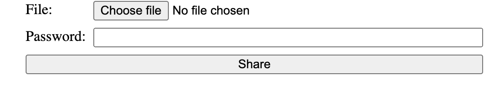

# File sharing app

## Table of contents

- [Overview](#overview)
  - [The challenge](#the-challenge)
  - [Screenshot](#screenshot)
  - [Links](#links)
  - [Built with](#built-with)
- [Author](#author)

## Overview

### The challenge

Users should be able to:

- Upload files
- Add a password to the file
- Download the file by the given link

### Screenshot

### Links

- Solution URL: [https://github.com/Horos20/file-sharing-app](https://github.com/Horos20/file-sharing-app)
- Live Site URL: [https://serene-depths-96304.herokuapp.com/](https://serene-depths-96304.herokuapp.com/)

### Built with

- CSS
- [Nodejs](https://nodejs.org/en/) - JS runtime 
- [Express](https://expressjs.com/) - Nodejs framework
- [MongoDB](https://www.mongodb.com/) - NoSQL database

## Author

- Website - [Matis Rammi](https://matisrammi.com/)